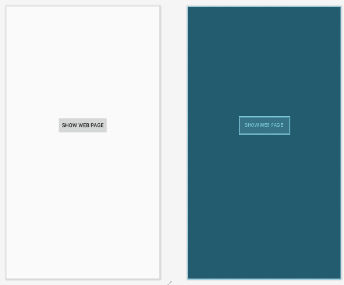
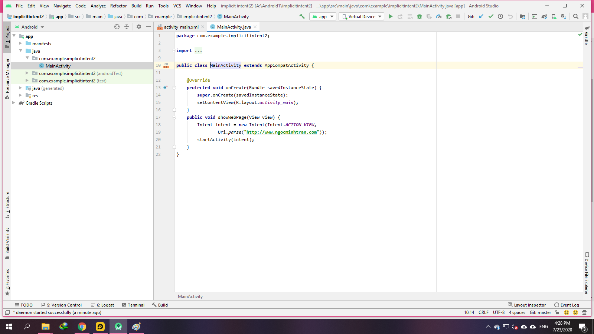
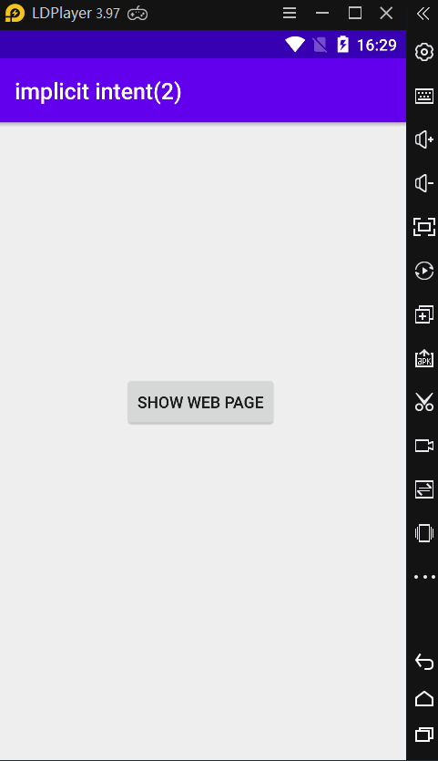
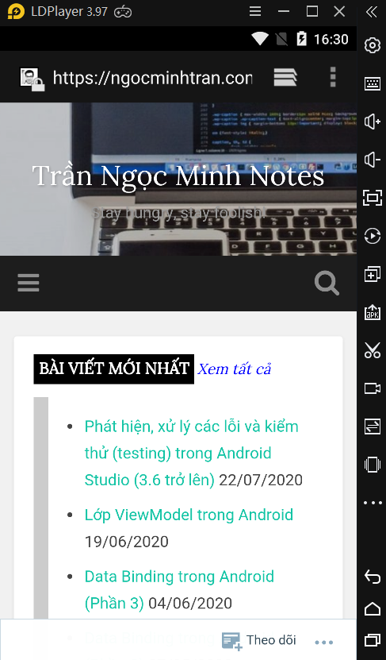

### ĐỐI TƯỢNG INTENT TRONG ANDROID (Phần 2)

- <a href= "https://ngocminhtran.com/2018/11/05/doi-tuong-intent-trong-android-phan-2/"> Ứng Dụng Từ Bài</a>

### Yêu Cầu
A. MÔ TẢ VỀ Android Studio:

### Intent ngầm định (implicit intent)
- Trong bài trước chúng ta đã tìm hiểu về Intent tường minh (explicit intent) – một cơ chế đòi hỏi chúng ta phải xác định rõ tên lớp Activity cần giao tiếp. Trong bài này chúng ta sẽ tìm hiểu về intent ngầm định – một cơ chế giao tiếp giữa các Activity dựa trên các kiểu hành động (actions) và kiểu dữ liệu được xử lý. Ví dụ chúng ta cần yêu cầu tải về một trang web và hiển thị trang web này đến người dùng. Với yêu cầu này chúng ta sẽ dùng kiểu hành động 
- ACTION_VIEW kèm theo một URL của một trang web trong hình thức một đối tượng URI

### Ứng dụng Android dùng intent ngầm định
- Tạo ứng dụng
- Tạo một ứng dụng mới tên ImplicitIntent, nhập ngocminhtran.com trong Company Domain, chọn Phone and Tablet và API 14, chọn Empty Activity và nhập tên ImplicitIntentActivity trong Activity Name và activity_implicit_intent tương ứng trong Layout Name.

- Mở tập tin activity_implicit_intent.xml trong chế độ Design, xóa TextView “Hello World!” mặc định, thêm một Button với giá trị thuộc tính ID và Text lần lượt 

### Tạo Intent ngầm định

- Chúng ta tạo xong chạy chương trình
- Ấn vào nút button sẽ thấy kết quả

### Lời kết
- Trong bài này chúng ta đã tìm hiểu kiểu Intent ngầm định và đã thực hiện tạo một ứng dụng minh họa dùng Intent này. Source code hoàn chỉnh các tập tin của ứng dụng ImplicitIntent

### Chúc Các Bạn Thành Công !!!

### Bạn Có Thể Xem Bài Tiếp Theo:

- <a href="https://github.com/ChanhMinions/SendBroadcast">ĐỐI TƯỢNG INTENT TRONG ANDROID (Phần 3)!</a>

                                                                         Trần Phú , Ngày 23 tháng 7 Năm 2020

